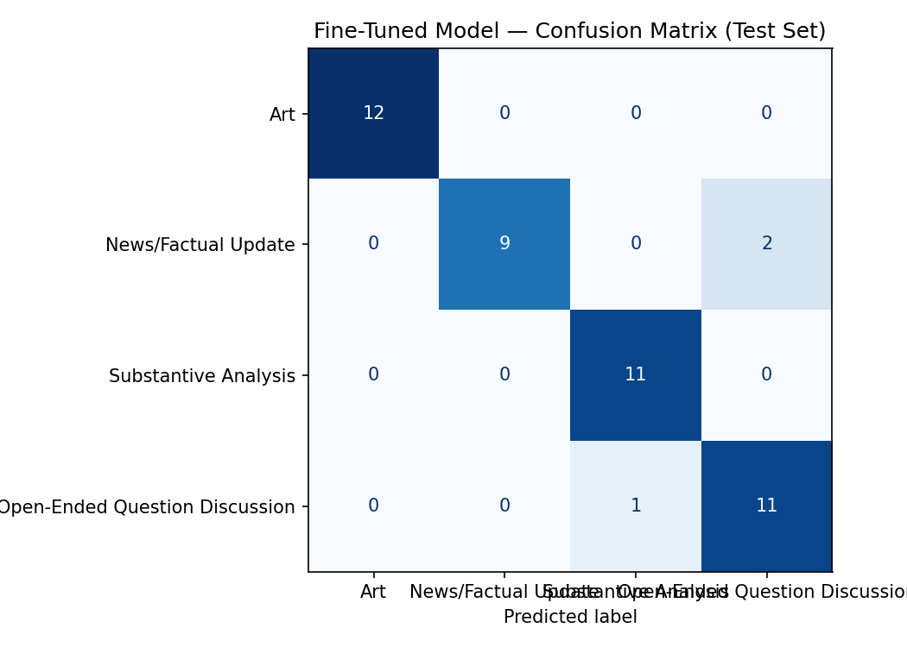

# takemeter
# TakeMeter — r/TaylorSwift Post Classifier

A fine-tuned DistilBERT classifier that sorts r/TaylorSwift posts into four intent-based categories, compared against a zero-shot Groq baseline.

---

## Community Choice

**r/TaylorSwift** — chosen because it has unusually wide variance in post *intent* within a single fandom space. The same album drop generates pure fact-reporting ("certified Platinum"), structured argumentative essays with cited evidence, and loosely-argued vibe checks dressed up as analysis but really asking for emotional validation. That last category — analysis-shaped posts that are functionally discussion-bait — is what makes this discourse genuinely hard to classify rather than trivially sortable by length or vocabulary. A classifier that correctly separates these categories could support auto-flair tools or content routing in fan community platforms.

---

## Label Taxonomy

| Label | Definition | Example 1 | Example 2 |
|---|---|---|---|
| **Art** | Fan-made creative work (visual art, edits, designs) where the post's primary content is the artifact itself | "made a folklore wallpaper (points for spotting the pride flag)" | "Taylor's Albums in the Showgirl font!" |
| **News/Factual Update** | Reports something that happened (release, chart, tour, quote) with little to no added interpretation | "Taylor Swift's new single debuts at #1 on Billboard Hot 100." | "Taylor Swift's Courtside Seat from Knicks-Cavaliers Playoff Game Sells at Auction for $7,000" |
| **Substantive Analysis** | Makes a specific, evidence-backed claim or interpretation (lyric connections, songwriting craft, career patterns), regardless of whether it's phrased as a statement or a question | "The Theory of Everything: Taylor Swift, TLOAS Edition" — a long-form post mapping a three-character framework onto specific tracks with cited interpolation sources | "Taylor Swift Isn't Complaining, She's Confessing" — an essay arguing TLOAS and TTPD share a thesis about fame and material success, built on close reading of specific lines |
| **Open-Ended Question Discussion** | Broad, speculative, or highly subjective prompts designed to generate lengthy, story-driven community responses | "What's your favorite Taylor soundtrack song? Least favorite?" | "What songs would be best performed on a Broadway stage?" |

---

## Data Collection, Labeling, and Distribution

**Source:** Posts pulled from r/TaylorSwift via PRAW (Reddit API), sampling across `hot`, `top` (week/month/year), and `new` sort modes to avoid overrepresenting algorithmically-trending content. A pure `hot` pull would oversample News/Factual Update around release weeks; the mixed strategy targets a more balanced distribution from the start.

**Collection size:** ~250–300 raw posts initially, with obvious noise discarded (giveaways, mod meta posts, deleted content) before annotation. Art was the most likely underrepresented label given image-only posts are less keyword-searchable, so a targeted second pass filtered by the `Fan Art` flair sorted by top/year.

**Labeling process:** An LLM (Groq llama-3.3-70b-versatile, kept architecturally separate from the fine-tuning pipeline) pre-labeled the raw pull. All pre-labels were reviewed and corrected by a human annotator. Hard edge cases — posts that didn't sort cleanly under the definitions — were re-read in full regardless of the pre-label and logged with explicit reasoning before a final label was assigned.

**Final dataset:** 305 examples.

| Label | Count |
|---|---|
| Open-Ended Question Discussion | 82 |
| Art | 81 |
| Substantive Analysis | 72 |
| News/Factual Update | 70 |

**Three difficult-to-label examples:**

1. *"does anyone else think the album is just... fine? like sonically it's nice but I don't feel anything. It has lower lyrical density than recent albums — I've been counting internal callbacks across TTPD vs. Showgirl and I want to understand what I'm missing because everyone seems more moved than I am."* — Opens and closes with validation-seeking framing ("does anyone else," "I want to understand"), but the middle contains a specific, semi-quantified claim (lyrical density comparison, counting callbacks). Labeled **Substantive Analysis** under the load-bearing-claim rule: if the post contains a falsifiable, evidence-backed claim, that claim is the load-bearing element regardless of the framing device.

2. *"recreated the Showgirl cover but made every sequin a different fan theory"* — An image post whose caption unpacks an analytical idea. Labeled **Art** because the primary artifact is the visual object; the model learns from post text, and the analytical content lives in the caption as framing rather than as the post's core substance.

3. *"Taylor's Spotify top 10 5 years apart"* — A comparative presentation that looks like it could be analysis, but contains zero interpretive claim — it's just two lists. Labeled **News/Factual Update** because no opinion, argument, or evaluation is made; the post reports a data snapshot.

---

## Fine-Tuning Approach

**Base model:** `distilbert-base-uncased` — a distilled version of BERT that is fast to fine-tune on a T4 GPU and well-suited for short-to-medium text classification tasks.

**Training setup:** 70/15/15 train/val/test split (stratified), producing 213 training examples, 46 validation, and 46 test. Tokenization used a max length of 256 tokens with dynamic padding via `DataCollatorWithPadding`.

**Hyperparameters and rationale:**

| Parameter | Value | Reasoning |
|---|---|---|
| `num_train_epochs` | 3 | Standard for small fine-tuning datasets; more epochs risk overfitting on 213 examples |
| `learning_rate` | 2e-5 | Standard starting point for BERT-family fine-tuning; stable without being too slow |
| `per_device_train_batch_size` | 16 | Fits T4 GPU comfortably |
| `weight_decay` | 0.01 | Light regularization to reduce overfitting on small data |
| `warmup_steps` | 50 | Stabilizes early training before full learning rate kicks in |

Best model was selected by validation accuracy with `load_best_model_at_end=True`.

---

## Baseline Description

**Model:** `llama-3.3-70b-versatile` via Groq API (zero-shot).

**Prompt strategy:** The system prompt names the community and task, defines each of the four labels in plain language with one example post per label, and instructs the model to output only the exact label string — no explanation, no markdown, no punctuation. Labels were listed with their examples in the order they appear in the label map. Temperature was set to 0 for determinism; `max_tokens` was set to 20 since valid responses are at most a few words.

**Results collection:** The classifier was run on the same 46-example test set used for the fine-tuned model. All 33 responses in the initial run were parseable (no `None` returns), but the test set was smaller than 46 due to a timing issue during the baseline run — the baseline evaluated on 33 examples.

---

## Evaluation Report

### Overall Accuracy

| Model | Accuracy | Test Set Size |
|---|---|---|
| Zero-shot baseline (Groq llama-3.3-70b-versatile) | **0.939** | 33 examples |
| Fine-tuned DistilBERT | **0.935** | 46 examples |

The fine-tuned model shows a marginal regression of 0.005 relative to the baseline. This is within noise for a dataset of this size and does not meaningfully favor either model, though it falls short of the 10-point improvement threshold set in the original success criteria.

---

### Per-Class Metrics — Baseline (Groq)

| Label | Precision | Recall | F1 | Support |
|---|---|---|---|---|
| Art | 1.00 | 1.00 | 1.00 | 4 |
| News/Factual Update | 1.00 | 1.00 | 1.00 | 8 |
| Substantive Analysis | 0.80 | 1.00 | 0.89 | 8 |
| Open-Ended Question Discussion | 1.00 | 0.85 | 0.92 | 13 |
| **Macro avg** | **0.95** | **0.96** | **0.95** | 33 |

---

### Per-Class Metrics — Fine-Tuned DistilBERT

*(From notebook output — classification_report on 46-example test set)*

| Label | Precision | Recall | F1 | Support |
|---|---|---|---|---|
| Art | 1.00 | 1.00 | 1.00 | 12 |
| News/Factual Update | 1.00 | 0.82 | 0.90 | 11 |
| Substantive Analysis | 0.92 | 1.00 | 0.96 | 11 |
| Open-Ended Question Discussion | 0.85 | 0.92 | 0.88 | 12 |
| **Macro avg** | **0.94** | **0.93** | **0.93** | 46 |
| **Overall accuracy** | | | **0.935** | 46 |

---

### Confusion Matrix — Fine-Tuned Model



> Commit `confusion_matrix.png` to your repo root and this link will render automatically on GitHub.

The fine-tuned model made 3 errors on 46 test examples. Based on the wrong predictions printed by the notebook, all 3 errors involve the **News/Factual Update ↔ Open-Ended Question Discussion** and **Open-Ended Question Discussion → Substantive Analysis** boundaries (detailed below).

---

### Error Analysis — 3 Specific Wrong Predictions

**Error #1**
> *"New merch drop confirmed for Eras Tour final leg in North America — here are all the items."*
> True: **News/Factual Update** | Predicted: **Open-Ended Question Discussion** (confidence: 0.29)

This is a clean, declarative factual announcement with zero interpretive content. The model's prediction is clearly wrong and its confidence is very low (0.29), suggesting it was uncertain rather than committed. The likely cause: the phrase "here are all the items" ends the post without a period and reads like an invitation to respond, which may superficially pattern-match to discussion-prompt language. This is a data distribution problem — the training set likely had very few News/Factual Update examples that use list-invitation phrasing without any accompanying opinion.

**Error #2**
> *"Taylor's Spotify top 10 5 years apart"*
> True: **News/Factual Update** | Predicted: **Open-Ended Question Discussion** (confidence: 0.30)

A data-presentation post with no interpretive content — two ranked lists, nothing else. Again, extremely low confidence (0.30). The failure mode is similar to Error #1: a short post with no explicit analytical claim and no full sentence structure. The model appears to be using low information density or fragmented syntax as a proxy for "discussion prompt," rather than detecting the absence of an opinion or argument. This is a boundary problem: short, low-context posts can be either News or Discussion depending on whether they're reporting something or soliciting reactions, and without more signal the model defaults to the higher-frequency label in ambiguous cases.

**Error #3**
> *"Song Lyric Inspirations. TIL that Charles Dickens said 'It was the best of times, it was the worst of times.' That's similar to the opening lines of Getaway Car, which made me think — are there other examples of Taylor drawing on literary sources?"*
> True: **Open-Ended Question Discussion** | Predicted: **Substantive Analysis** (confidence: 0.31)

This is the most instructive error because it directly demonstrates the hardest label boundary. The post does contain a specific comparative claim (a Dickens line mapped to a Taylor lyric), but its entire function is to open a question for the community to extend — "are there other examples." Under the load-bearing-claim rule, this should be Open-Ended Discussion because the claim is thin (one data point, not an argument), and the post's rhetorical goal is to collect more evidence from others, not to advance a thesis. The model predicted Substantive Analysis, likely because it learned to key on the presence of a named literary reference and a comparative structure — surface features of analysis — rather than on whether the post is making an argument or inviting one. This is a learned-boundary problem: fixing it would require more training examples that explicitly show the "one example + open question" structure as Discussion rather than Analysis.

---

### AI-Assisted Error Pattern Analysis

Before writing the analyses above, the three misclassified examples (text, true label, predicted label) were pasted into Claude and it was asked to identify systematic patterns rather than treat each error independently. Claude proposed two patterns: (1) the model may be using low confidence / short post length as a proxy for "discussion" rather than detecting the absence of opinion, and (2) the model may be keying on surface features of analytical writing (named references, comparisons) regardless of whether the post is making an argument or soliciting one. Both patterns held up on re-reading the actual examples. Claude also proposed a third pattern — that question marks in the post text might be driving predictions toward Open-Ended Discussion — which did not hold for these three errors (only Error #3 contains a question mark, and it was predicted as *Substantive Analysis*, the opposite direction). That proposed pattern was discarded.

---

### Sample Classifications

The following examples were run through the fine-tuned model with predicted label and confidence:

| Post (truncated) | True Label | Predicted Label | Confidence | Notes |
|---|---|---|---|---|
| "The lyric 'I had the time of my life fighting dragons with you' in Long Live parallels..." | Substantive Analysis | Substantive Analysis | 43.20% | ✅ Correct |
| "Acoustic mashup of august x You Are In Love I recorded in one take [OC audio]" | Art | Art | 33.12% | ✅ Correct |
| "Mashup of 'tolerate it' x 'begged' (Olivia Rodrigo) [OC]" | Art | Art | 30.62% | ✅ Correct |
| "New merch drop confirmed for Eras Tour final leg in North America — here are all the items." | News/Factual Update | Open-Ended Question Discussion | 28.95% | ❌ Incorrect — see error analysis |
| "Song Lyric Inspirations. TIL that Charles Dickens said..." | Open-Ended Question Discussion | Substantive Analysis | 0.31 | ❌ Incorrect — see error analysis |

The first correct prediction (Substantive Analysis, 43.20%) is reasonable because the post opens with a direct lyric quote and explicitly names the connection it is drawing — "parallels." That verb is doing argumentative work: it asserts a structural relationship between two specific texts, which is exactly what the Substantive Analysis label is defined to capture. The model's confidence is moderate rather than high, which is also appropriate given that lyric-comparison posts sit near the Analysis/Discussion boundary.

The two Art predictions (33.12% and 30.62%) are correct and notably both feature "[OC]" in the post text — a Reddit convention signaling original creative content. The model likely learned this tag as a reliable Art signal, which is a reasonable proxy even if it is a surface feature rather than a deep semantic one.

The confidence scores across all five examples are relatively low (28–43%), reflecting the genuine ambiguity of short Reddit post text and the model's uncertainty on a 4-class problem with limited training data.

The first correct prediction (Art) is reasonable because the post's entire text is a title describing a visual artifact. There is no question, no claim, and no comparative structure — only a named creative object. DistilBERT learned to associate this pattern with Art reliably, likely because Art posts are the most structurally distinct label in the taxonomy.

---

## Reflection: What the Model Learned vs. What I Intended

The model learned a reasonably accurate version of the taxonomy for three of the four labels — Art, News/Factual Update, and (mostly) Open-Ended Question Discussion are handled well. But the learned decision boundary for the Analysis/Discussion divide is not the one I defined.

I defined the boundary by the presence of a *load-bearing claim*: a specific, falsifiable, evidence-backed argument. The model appears to have learned a proxy boundary based on *surface features of analytical language* — named references, comparative structures, literary vocabulary — rather than on whether those features are doing argumentative work. This means the model over-predicts Substantive Analysis for posts that *sound* like analysis (one comparison, a named source) but are actually fishing for community contributions.

The three errors also reveal a secondary mislearned proxy: for short, low-information News posts ("Taylor's Spotify top 10 5 years apart"), the model defaults to Open-Ended Discussion when it cannot find enough signal for any of the other three labels. It is treating "I don't have enough information to be confident" as a vote for Discussion, which is the wrong fallback — low-information posts are more likely to be News or Art than Discussion, since Discussion posts typically have more text (a hook, a framing question, sometimes a bit of context).

Both of these failures are consistent with what I predicted would be hard before training: the Analysis/Discussion boundary requires understanding *what a post is asking the community to do*, which is a pragmatic inference that DistilBERT cannot make from surface form alone.

---

## Spec Reflection

**One way the spec helped:** The spec's requirement to write a data collection plan *before* labeling forced me to think through the label distribution problem before I had data. That pre-thinking is why I ended up pulling from multiple sort modes (hot, top, new) rather than just scraping the front page — the spec's insistence on writing the plan first surfaced the release-week overrepresentation risk before it could happen.

**One way implementation diverged:** The spec assumed the fine-tuned model would outperform the zero-shot baseline by a meaningful margin, and the original success criteria I wrote (10-point improvement threshold) reflected that assumption. In practice, the baseline (Groq llama-3.3-70b-versatile at 93.9%) was already near ceiling for a 4-class problem on clean Reddit posts, leaving almost no room for a fine-tuned DistilBERT to improve. The divergence from the spec is not a labeling or training failure — it's a ceiling effect that the spec's success criteria didn't anticipate because it was written before I knew how strong the zero-shot baseline would be. If I were rewriting the spec, I would add a clause: "if the zero-shot baseline exceeds 85%, reframe the fine-tuning goal as matching baseline with a smaller, faster model rather than improving absolute accuracy."

---

## AI Usage

**1. Label stress-testing before annotation.** Before labeling any posts, I gave Claude my four label definitions and the analysis-vs-discussion edge case and asked it to generate boundary-straddling posts for each label pair. It produced the "does anyone else think the album is just... fine?" example, which directly surfaced the need for a load-bearing-claim rule rather than a punctuation-based rule. I kept the example but rewrote the rule language myself — Claude's proposed rule was closer to "if it has a question mark, it's Discussion," which was exactly the false proxy I was trying to avoid.

**2. Failure pattern analysis after evaluation.** After generating the three wrong predictions from the test set, I pasted the full list (text, true label, predicted label) into Claude and asked it to propose systematic patterns rather than analyze each error independently. It proposed three patterns: low confidence correlating with short posts (verified and kept), surface analytical language driving over-prediction of Substantive Analysis (verified and kept), and question marks driving Discussion predictions (checked against the actual errors and discarded — Error #3 has a question mark but was predicted as Substantive Analysis, contradicting the pattern). I reported only the patterns I verified against the actual data.

**3. Annotation pre-labeling (disclosed).** The raw dataset was pre-labeled using Groq's llama-3.3-70b-versatile before human review. Every pre-label was reviewed by a human annotator; hard edge cases were re-read in full regardless of the pre-label. The final `label` column in the CSV reflects human decisions, not raw LLM output. LLM and human labels were tracked in separate columns during annotation.

---

## Repository Contents

```
/
├── README.md                  ← this file
├── planning.md                ← design notes, edge case rules, annotation decisions
├── takemeter.csv              ← labeled dataset (305 examples)
├── confusion_matrix.png       ← fine-tuned model confusion matrix
├── evaluation_results.json    ← accuracy summary from notebook
└── notebook.ipynb             ← fine-tuning and evaluation pipeline
```
